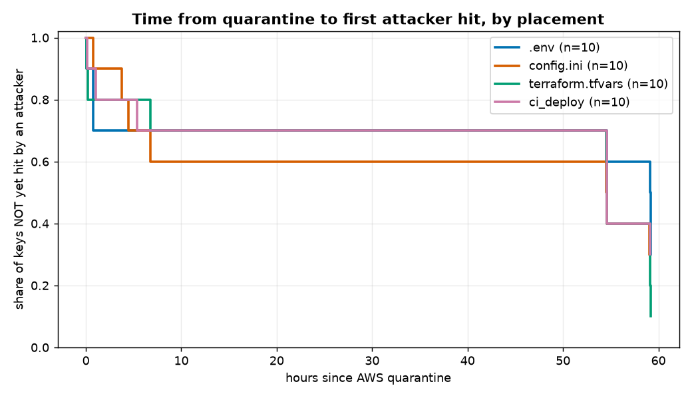
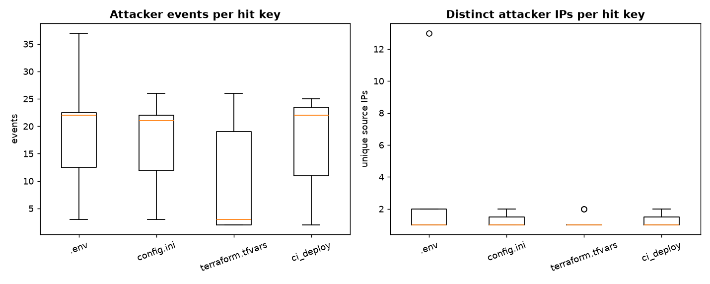

# Placement A/B experiment — results (interim)

_Data window through 2026-09-05 00:52 UTC. 50 repos (10 matched blocks x 5 conditions, 2 waves). Primary endpoint: time from AWS quarantine to first attacker hit; cells with no attacker hit yet are right-censored._

## Design check: controls

Control repos hit by an attacker: **0 / 10**. A fake key attracts nothing, so attacker hits on the live cells are real signal, not scanner background.

## Cells hit so far

| Placement | cells hit / total | attacker events | median hit time (h from quarantine) |
|---|---:|---:|---:|
| .env | 7/10 | 132 | 54.6 |
| config.ini | 7/10 | 118 | 6.8 |
| terraform.tfvars | 9/10 | 95 | 54.6 |
| ci_deploy | 7/10 | 118 | 54.6 |

## Primary: log-rank across the 4 placements

| Placement | observed hits | expected hits |
|---|---:|---:|
| .env | 7 | 8.6 |
| config.ini | 7 | 6.9 |
| terraform.tfvars | 9 | 6.8 |
| ci_deploy | 7 | 7.7 |

Log-rank chi-square = **1.46**, df = 3, **p = 0.692** -> **no significant difference** in time-to-first-hit between placements.

## Secondary: intensity and attacker diversity

- Attacker **events per hit key** by placement: Kruskal-Wallis H = 4.53, p = 0.210 (not significant).
- **Distinct attacker IPs per hit key**: H = 1.12, p = 0.773 (not significant).

## Kill-chain action mix (attacker events, by placement)

| action | .env | config.ini | terraform.tfvars | ci_deploy |
|---|---:|---:|---:|---:|
| `GetCallerIdentity` | 127 | 118 | 95 | 118 |
| `SimulatePrincipalPolicy` | 1 | 0 | 0 | 0 |
| `ListFoundationModels` | 1 | 0 | 0 | 0 |
| `DescribeRegions` | 1 | 0 | 0 | 0 |
| `ListBuckets` | 1 | 0 | 0 | 0 |
| `CreateUser` | 1 | 0 | 0 | 0 |

## Read this honestly

- With ~7-10 cells per placement this is **low-powered**; treat p-values as directional, not final.
- Attacker arrivals cluster at wall-clock **scanner sweeps**, so time-to-first-hit is largely driven by *when the next sweep runs*, which is the same for every placement. A null result on timing is the expected and honest outcome: automated GitHub secret-scanning finds a leaked key regardless of which file it sits in.
- The live signal to keep watching is the **secondary** metrics (how hard each key gets worked, how many distinct attackers), which keep accumulating.
